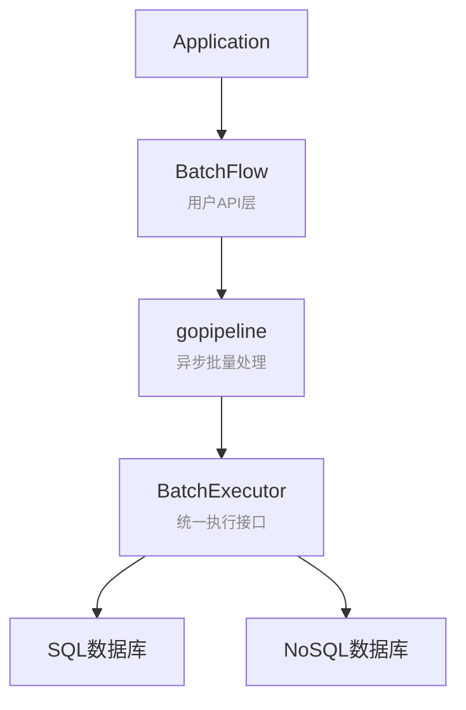

# BatchFlow 架构设计文档

## 🏗️ 整体架构概览

BatchFlow 采用分层架构设计，通过统一的 `BatchExecutor` 接口支持多种数据源类型，同时为不同类型的数据源提供最适合的实现方式。



## 🎯 核心设计原则

### 1. 统一接口，灵活实现
- **BatchExecutor** 作为所有数据源驱动的统一接口
- 不同类型数据源可选择最适合的实现方式
- 保持API一致性的同时避免过度抽象

### 2. 可选的抽象层
- **BatchProcessor** 不是必须的，用于复用“生成操作 + 执行操作 + retry/metrics/observer”的执行控制逻辑
- SQL 和 Redis 默认使用 `ThrottledBatchExecutor + BatchProcessor`
- 其他 NoSQL、HTTP、消息推送可以直接实现 `BatchExecutor`，也可以实现 `BatchProcessor` 后复用通用执行器
- 测试环境使用 MockExecutor 直接实现

### 3. 职责分离
- **BatchFlow**: 用户API和管道管理
- **BatchExecutor**: 执行控制和指标收集
- **BatchProcessor**: 后端操作生成和执行逻辑（可选）
- **SQLDriver**: 数据库特定的SQL生成

## 📊 实现方式对比

| 数据源类型 | 实现方式 | 架构路径 | 优势 |
|-----------|---------|---------|------|
| **SQL数据库**<br>(MySQL/PostgreSQL/SQLite) | ThrottledBatchExecutor（可选限流 WithConcurrencyLimit） + SQLBatchProcessor + SQLDriver | BatchFlow → ThrottledBatchExecutor → SQLBatchProcessor → SQLDriver → DB | 代码复用、标准化、易扩展、可节流 |
| **NoSQL数据库**<br>(Redis/MongoDB) | Redis 默认使用 ThrottledBatchExecutor + RedisBatchProcessor；其他后端可直接实现 BatchExecutor | BatchFlow → ThrottledBatchExecutor/CustomExecutor → DB | 可复用通用执行控制，也可保留后端特化 |
| **消息推送**<br>(钉钉机器人/微信/邮件) | 直接实现BatchExecutor | BatchFlow → CustomExecutor → API | 批量推送、错误重试、灵活配置 |
| **API调用**<br>(REST/GraphQL) | 直接实现BatchExecutor | BatchFlow → CustomExecutor → HTTP | 批量请求、并发控制、统一处理 |
| **测试环境** | MockExecutor | BatchFlow → MockExecutor → Memory | 快速测试、无依赖 |

## 🔧 详细架构分析

### SQL数据库架构

```
Application
    ↓
BatchFlow.Submit()
    ↓
gopipeline (异步批量处理)
    ↓
ThrottledBatchExecutor.ExecuteBatch()
    ├── 可选并发限流（WithConcurrencyLimit）
    ├── 重试与退避（WithRetryConfig）
    ├── 指标、结构化事件和错误分类
    └── 调用 BatchProcessor
        ↓
SQLBatchProcessor.GenerateOperations()
    ├── GenerateSQLPreview()
    ├── 调用 SQLDriver 生成最终 SQL
    └── 返回 SQL 字符串和参数
        ↓
SQLBatchProcessor.ExecuteOperations()
    └── ExecContext 执行数据库操作
        ↓
SQLDriver.GenerateInsertSQL(ctx, schema, data)
    ├── MySQL: INSERT ... ON DUPLICATE KEY UPDATE
    ├── PostgreSQL: INSERT ... ON CONFLICT DO UPDATE
    └── SQLite: INSERT OR REPLACE
        ↓
Database Connection
```

**优势：**
- 代码复用：所有SQL数据库共享执行逻辑
- 标准化：统一的错误处理和指标收集
- 易扩展：新增SQL数据库只需实现SQLDriver

**适用场景：**
- 关系型数据库
- 需要复杂SQL语法的场景
- 需要事务支持的场景

### NoSQL数据库架构

```
Application
    ↓
BatchFlow.Submit()
    ↓
gopipeline (异步批量处理)
    ↓
ThrottledBatchExecutor 或 CustomExecutor
    ├── 使用 ThrottledBatchExecutor: 复用限流、重试、metrics、observer
    └── 直接实现 BatchExecutor: 完全自定义执行控制
        ↓
Database/API Client
    ├── Redis: Pipeline 操作
    ├── MongoDB: BulkWrite 操作
    └── HTTP/API: 批量请求
```

**选择建议：**
- 需要统一 retry、metrics、结构化日志：实现 `BatchProcessor`，交给 `ThrottledBatchExecutor`。
- 已有成熟执行控制或需要完全自定义：直接实现 `BatchExecutor`。
- 需要 dry-run/诊断：额外实现 `OperationPreviewer`，提供 backend、operation、fingerprint 和低基数 attributes。

**适用场景：**
- NoSQL数据库
- 需要特定优化的场景
- 数据模型与SQL差异较大的场景

## 🚀 扩展指南

### 添加新的SQL数据源支持

1. **实现SQLDriver接口**
```go
type TiDBDriver struct{}

func (d *TiDBDriver) GenerateInsertSQL(ctx context.Context, schema *batchflow.SQLSchema, data []map[string]any) (string, []any, error) {
    // TiDB特定的SQL生成逻辑
    return sql, args, nil
}
```

2. **创建工厂方法**
```go
func NewTiDBBatchFlow(ctx context.Context, db *sql.DB, config PipelineConfig) *BatchFlow {
    executor := batchflow.NewSQLThrottledBatchExecutorWithDriver(db, &TiDBDriver{})
    return NewBatchFlow(ctx, config.BufferSize, config.FlushSize, config.FlushInterval, executor)
}
```

### 添加新的NoSQL数据源支持

1. **直接实现BatchExecutor接口**
```go
type MongoExecutor struct {
    client          *mongo.Client
    metricsReporter batchflow.MetricsReporter
}

func (e *MongoExecutor) ExecuteBatch(ctx context.Context, schema batchflow.SchemaInterface, data []map[string]any) error {
    // MongoDB特定的批量操作逻辑
    collection := e.client.Database("mydb").Collection(schema.Name)
    docs := make([]interface{}, len(data))
    for i, row := range data {
        docs[i] = row
    }
    _, err := collection.InsertMany(ctx, docs)
    return err
}

func (e *MongoExecutor) WithMetricsReporter(reporter batchflow.MetricsReporter) *MongoExecutor {
    e.metricsReporter = reporter
    return e
}
```

2. **创建工厂方法**
```go
func NewMongoBatchFlow(ctx context.Context, client *mongo.Client, config PipelineConfig) *BatchFlow {
    executor := &MongoExecutor{client: client}
    return NewBatchFlow(ctx, config.BufferSize, config.FlushSize, config.FlushInterval, executor)
}
```

## 🔍 关键组件详解

### BatchExecutor 接口
```go
type BatchExecutor interface {
    ExecuteBatch(ctx context.Context, schema SchemaInterface, data []map[string]any) error
}
// 说明：指标配置应在具体类型或能力接口上进行（如在 ThrottledBatchExecutor 上调用 WithMetricsReporter）。
// 在仅持有 BatchExecutor 的通用路径，框架通过只读探测 MetricsReporter() 判断是否已有 Reporter；若无，则内部使用 Noop 兜底，不写回执行器。
```

**职责：**
- 统一的批量执行接口
- 指标报告器管理
- 所有数据库驱动的入口点

### BatchProcessor 接口（可选）
```go
type BatchProcessor interface {
    GenerateOperations(ctx context.Context, schema SchemaInterface, data []map[string]any) (Operations, error)
    ExecuteOperations(ctx context.Context, operations Operations) error
}
```

**职责：**
- 后端操作生成，例如 SQL 字符串、Redis command、HTTP request descriptor
- 后端操作执行
- 与 `ThrottledBatchExecutor` 配合使用，复用限流、重试、metrics、observer
- 自定义后端可跳过此层，直接实现 `BatchExecutor`

### SQLDriver 接口
```go
type SQLDriver interface {
    GenerateInsertSQL(ctx context.Context, schema *SQLSchema, data []map[string]any) (string, []any, error)
}
```

**职责：**
- 生成数据库特定的SQL语句
- 处理不同数据库的语法差异
- 支持不同的冲突处理策略

## 📈 性能优化策略

### 1. 内存优化
- 使用指针传递减少内存复制
- 按Schema分组减少数据库操作次数
- 全局SQLDriver实例共享

### 2. 并发优化
- 异步批量处理管道
- 支持多goroutine并发提交
- 自动背压控制

### 3. 数据库优化
- 批量INSERT语句
- 数据库特定的优化语法
- 连接池复用（用户管理）

## 🧪 测试策略

### 1. 单元测试
- 使用MockExecutor进行无依赖测试
- 测试各个组件的独立功能
- 验证SQL生成逻辑

### 2. 集成测试
- 真实数据库环境测试
- 多数据库兼容性验证
- 性能基准测试

### 3. 架构测试
- 验证不同实现方式的正确性
- 确保接口一致性
- 测试扩展能力

## 🎉 架构优势总结

1. **灵活性**: 支持SQL和NoSQL数据库的不同实现方式
2. **可扩展性**: 易于添加新的数据库支持
3. **性能**: 避免过度抽象，允许数据库特定优化
4. **一致性**: 统一的API和错误处理
5. **可测试性**: 完善的Mock支持和测试策略
6. **代码复用**: SQL数据库共享通用逻辑
7. **职责分离**: 清晰的组件边界和职责划分

这种架构设计既保持了灵活性，又避免了过度工程化，为不同类型的数据库提供了最适合的实现方式。
